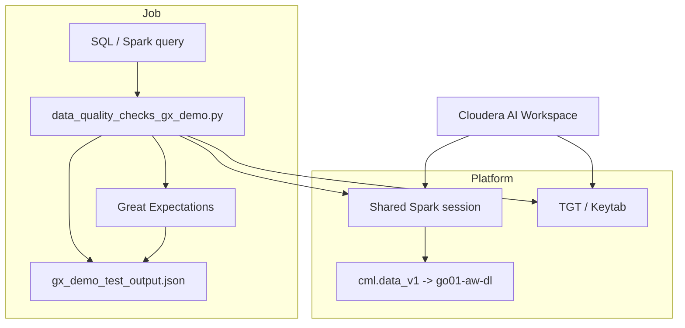

# GREAT EXPECTATIONS / DATA QUALITY JOBS

GX-focused PySpark runners that read Hive tables, apply expectation suites, and emit JSON validation artifacts.

## Environment snapshot

- Python 3.11.14 (preloaded dependencies under `/home/cdsw/.local/lib/python3.11/site-packages`).  
- PySpark 3.5.1 (Scala 2.12.18) with Kerberos enabled—jobs require a valid `kinit` ticket for Hive/S3 access.  
- Great Expectations 1.15.1; use `pip install "great_expectations[spark]"` or the shipped `requirements.txt` to reproduce locally.

## Running this suite in Cloudera AI (CAI)

These scripts are designed to be run inside a CAI workspace that already configures Spark, Hive, Kerberos, and the
`go01-aw-dl` CML connection. To onboard external customers:

1. **Prepare the workspace** – launch a CAI project running Python 3.11 + Spark 3.5.1, upload `gx_demo`, and place
   `go01-demo-aws-manishm.keytab` in `/home/cdsw`.
2. **Authenticate** – run `kinit -kt /home/cdsw/go01-demo-aws-manishm.keytab manishm@GO01-DEM.YLCU-ATMI.CLOUDERA.SITE` to give
   the CAI driver pod a TGT; CAI already exposes the `CDSW_*` vars used by `cml.data_v1`.
3. **Execute the GX demo** – trigger `python data_quality_checks_gx_demo.py -o gx_demo_test_output.json` from the project
   root. The script will either reuse the shared Spark session via `cmldata.get_connection("go01-aw-dl")` or fall back to
   a local builder that already configures the Iceberg catalog and Kerberos extensions. Validation results land in
   `gx_demo_test_output.json`.
4. **Interpret the output** – open the generated JSON or inspect `gx_demo_run.log` for the GE statistics (success percent,
   failing expectations, observed values). The job writes the final line `Validation saved to gx_demo_test_output.json`.
5. **Extend to other tables** – copy `data_quality_checks_gx_demo.py`, edit `DEFAULT_CONFIG` for the new schema, and run
   the script with `--config my_overrides.json` and `--query "SELECT ..."` against any CAI cluster-accessible table.

Because CAI already sets the Spark defaults (see `spark-defaults.conf`), you do not need to pass additional JVM
properties. Validating inside CAI ensures the same Kerberos/IDBroker context used by production workloads is applied here
too.

## Inspecting `gx_demo_test_output.json`

| What to inspect | Why it matters | Tip |
| --- | --- | --- |
| `statistics.success_percent` | Overall pass rate | >90% means most expectations succeeded. |
| `statistics.successful_expectations` / `evaluated_expectations` | Counts per run | Helps verify how many checks executed. |
| `results[*].expectation_config.type` + `success` | Per-check status | Filter `success == false` to identify failing expectations. |
| `results[*].result.observed_value` | Actual metric values | Compare to configured thresholds during troubleshooting. |
| `run_id.run_time` | Execution timestamp | Match the JSON to `gx_demo_run.log` for correlated logs. |

Quick script to print the summary and failing expectations:

```bash
python - <<'PY'
import json
from pathlib import Path

report = json.loads(Path("gx_demo_test_output.json").read_text())
print("Success %:", report["statistics"]["success_percent"])
for r in report["results"]:
    if not r["success"]:
        print(r["expectation_config"]["type"], r["result"].get("observed_value"))
PY
```

Loading `gx_demo_test_output.json` in CAI (click the file) also renders it in the notebook UI for quick review.

### Architecture sketch



## Data-quality jobs

### `data_quality_checks_hms_table.py`

Validates `airlines_iceberg.flights` via Hive, covering schema, ranges, uniqueness, and regex checks. Writes
`hms_validation_result.json` with the suite stats.

### `data_quality_checks_gx_demo.py`

Runs an extensive GE suite against `manishm.gx_demo_table` (completeness, numeric stats, schema, SQL guards,
uniqueness, validity, volume, and multi-source comparisons). It prefers the `go01-aw-dl` connection but can fall
back to a local `SparkSession` that already configures Iceberg/Kerberos when needed. Outputs a validation JSON (default
`gx_demo_validation_result.json`) and respects optional `--config` overrides.

## Extending the checks

1. Copy `data_quality_checks_gx_demo.py` (or create a new driver) and adjust `DEFAULT_CONFIG` to include the
   new table’s columns, type hints, value ranges, regexes, and peer comparisons.
2. Implement helper functions per quality category (`apply_completeness_checks`, `apply_numeric_checks`, etc.)
   referencing the new configuration entries.
3. Guard expensive checks with `run_if_columns_present` (or similar) so the expectation suite is resilient to schema drift.
4. Wire the new script into your orchestration tool with the appropriate query/setup and direct the output JSON to
   your desired location.

## Checking most-recent partition data only

When you only want to validate the most recent partition, parameterize the SQL query that feeds each job. For
example, replace the default `SELECT * FROM manishm.gx_demo_table` with:

```sql
SELECT * FROM manishm.gx_demo_table
WHERE ingestion_date = (
  SELECT MAX(ingestion_date) FROM manishm.gx_demo_table
)
```

Or, in PySpark, build a DataFrame with `spark.table("manishm.gx_demo_table").filter("ingestion_date = current_date")`
before passing it to `SparkDFDataset`. This ensures every expectation runs only on the latest slice.

If your table partitions by `snapshot_date` or numeric `yyyymmdd`, swap `ingestion_date` for that column and repeat the
`MAX(...)` filter. In PySpark, collect the max partition value, filter the DataFrame, then wrap it in `SparkDFDataset`
so validation always targets the newest partition.
